--- 
author: Samir Halilčević
date: Marvelsoft, 2019-10-17
title: Persistence in Event-Driven Architecture
---

### 
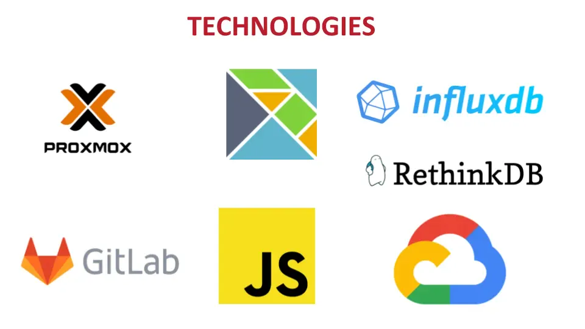

### Hello
* Samir Halilčević, programmer,
* been at Marvelsoft for about one year,
* main tasks are the content of this presentation,
* not alone, work of multiple great people

### Problem Statement?

### What is 'Event-Driven' anyway?
* Events are the driving force in the app,
* Everything that happens is a reaction to some outside action
* Application sleeps until something interesting happens

### Network event 
* Classic approach
```

char[] buffer
loop {
  // sleep(10ms)
  if socket.try_read(buffer) {
    do_work(buffer) 
  }
}

```

### Network event 
* Event driven approach
```

let f = socket.into_future().and_then(do_work)
reactor.start(f)

```

### DISCLAIMER
* There are a thousand ways to do event-driven,
* and a hundred ways to do persistence!
* This is just our take on things...

### How we approached it:
> don't communicate by sharing memory; share memory by communicating. 
>
> Rob Pike

* All events are messages,
* Messages flow through the system,
* Only messages induce state changes.

### How to detach it to threads?

```

class State {
  handle(string s) {
    println(s)
  }
}

let state = State::new()
for line in stdin.lock() {
  state.handle(s)
}

```

### How to detach it to threads?

```

let state = State::new()
let mailbox = Queue::new()
Thread::new(|| {
  for line in stdin.lines() {
    mailbox.push(line)
  }
});
Thread::new(|| {
  for msg in mailbox.next() {
    state.handle(msg)
  }
});

```

### Queue == Mailbox?
* Mailbox = Queue with multiple write points, one read point,
* Thread blocks until a message arrives,
* The state of the object is handled only in one thread.

### And we have created an actor
* Actor = state + mailbox

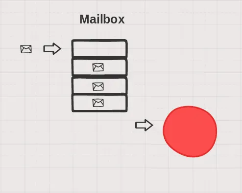

### And we have created an actor
* Actor = state + mailbox
* Actors basically boil down to state machines

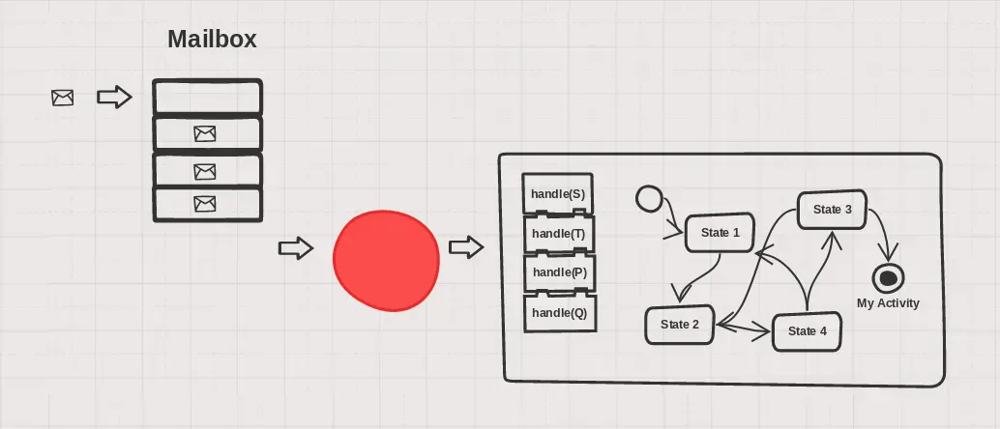

### What can an actor do?
* An actor can receive a message.
* An actor can send a message.
* An actor can spawn another actor.

### Actor architecture benefits
* Simple concurrency,
* simple state management,
* value-based data model,
* all state changes are local,
* maximises performances.

### How we did 'event-driven' in the end?

### How did it end up?


### How did it end up?
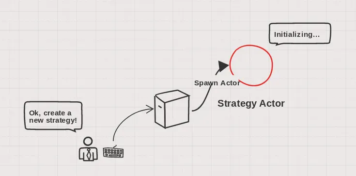

### How did it end up?
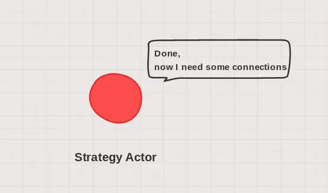

### How did it end up?
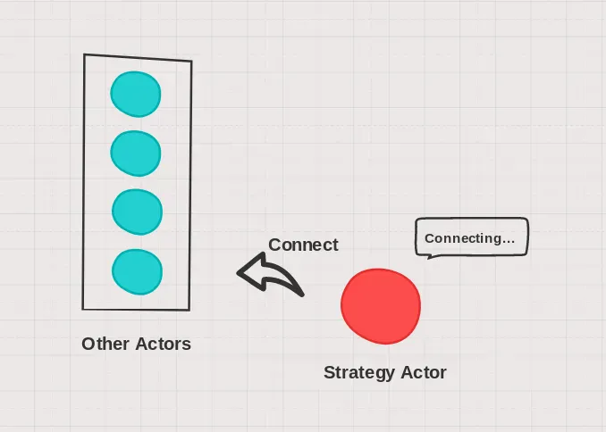

### How did it end up?
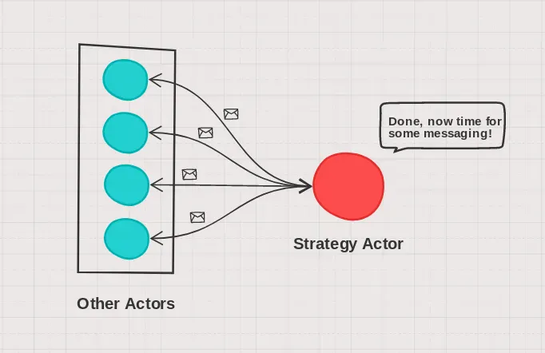

### How did it end up?
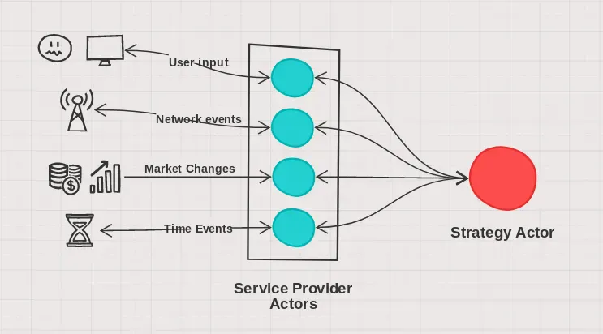

### How did it end up?
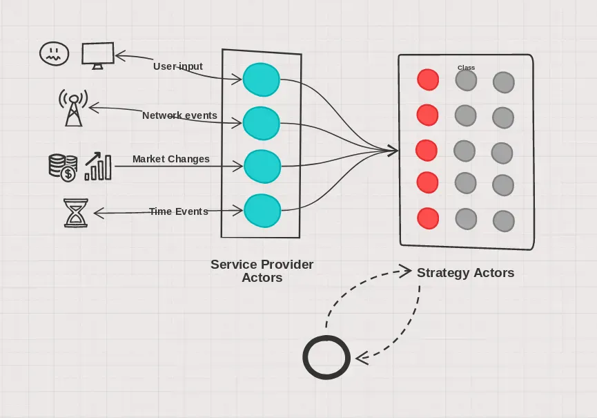

### How we did 'event-driven' in the end?
* All state is kept in small, bite-sized pieces inside actors,
* All state changes happen on message receiving,
* All outside events are converted into messages by service actors.
* A Known number of actors provide services to other actors,
* An Arbitrary number of strategy actors, which communicate only with service actors.

### Everything was going well util...
>  we need to implement persistence!

* Nothing was persisted, 
* No idea how to start
* ORM or not?

### Spoiler
What can go wrong if we just reproduce the messages to the actor?

### Sequential consistency of messages
> If the stream of messages stays the same
> will state changes in the actor stay the same?

### Sequential consistency of messages
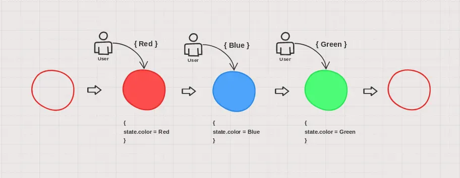

### Sequential consistency of messages
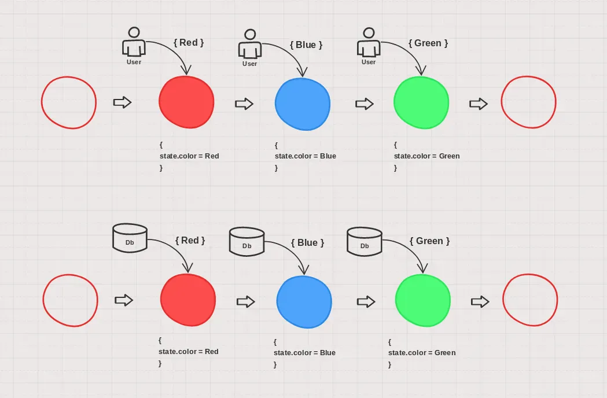

### Anyhow, what affects the actor's state?
* Initial state (that is what we spawn)
* Messages, since its birth to the shutdown
* Impure system calls

### The initial state
Suppose that the same arguments for construction will be the same
in the initial run and the rebuild run.

### The messages
Insert a database hook to every message handle

```

receive() {
  while msg = mailbox.next() {
    state.handle(msg)
  }
}

```

### The messages
Insert a database hook to every message handle
```

receive() {
  while msg = mailbox.next() {
    state.handle(msg)
    db.store(msg)
  }
}

```

### Database structure
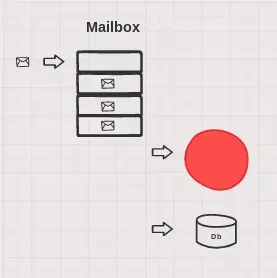

### Database structure
* A database store after every message handle,
* Every actor has its own uuid,
* After the message is handled, the database stores
  uuid, time and a serialized message.


### Database read
* Another component that handles reading
* Actor that responds with all your previous events
* Handles many reads in parallel

### Database structure
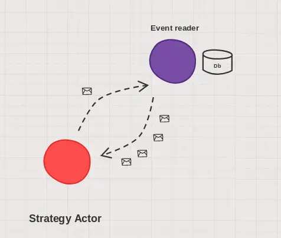

### Database
* We chose an embedded database
* RocksDB - key/value database, facebook
* Append only use case, no deletes or modifies
* Sequential read, usually one pass through everything at the start of the program

### How to handle side effects
Side effects include 

* Time
* Random numbers
* Messages sent to other actors

### Problems with time
* One run starts in the morning, 
* Lets say at noon we restart the application.
* All calls to getTime are wrong!

### Problems with time
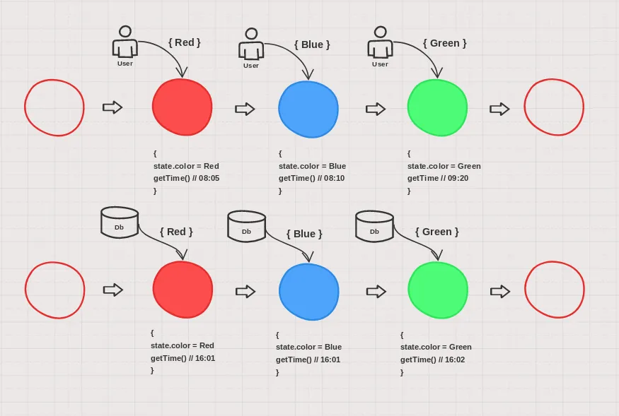

### How we solved it
* Introduce time service,
* Store the arrival time of every message,
* Fake the time during rebuild.

### Message handling
During the normal run

```

receive() {
  while msg = mailbox.next() {
    msg.time = time.now()
    state.setTime(msg.time)
    state.handle(msg)
    db.store(msg)
  }
}

```

### Message handling
During the rebuild run
```

receive() {
  while msg = mailbox.next() {
    state.setTime(msg.time)
    state.handle(msg)
  }
}

```

### Problems with randomness
Every time we call a random number, 
different random number is returned.

### Problems with randomness
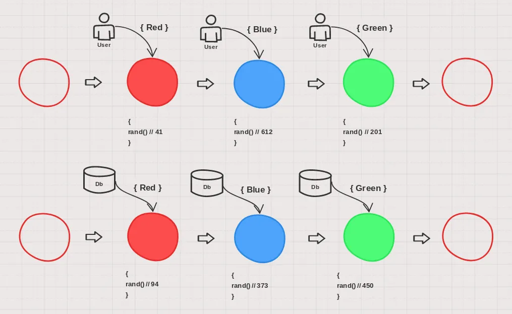

### How we solved it
* Every actor has it's own random number generator,
* Set the seed upon actor spawn,
* If the seed is the same, then the sequence of random numbers are the same.

### Actor spawning
Before:

```

spawn(args...) {
  let mailbox = Mailbox::new()
  let state = State::new(args...)
  reutrn mailbox
}

```

### Actor spawning
After:

```

spawn(uuid, args...) {
  let mailbox = Mailbox::new()
  let state = State::new(args...)
  state.randomGenerator.setSeed(uuid)
  reutrn mailbox
}

```

### Sending messages
* Actor `A` gets a message, and as a result sends a message to it's
buddy `B`,
* Messages have been recorded during the run,
* In the rebuild, B would get the same message two times, 
once from A and once from the database!

### Well, that was easy
* During the rebuild, all sends are just dropped,
* State has its own sender class,
* Sender is blocked until all rebuild messages are processed.

### Actor spawning
After:

```

spawn(uuid, args...) {
  let mailbox = Mailbox::new()
  let state = State::new(args...)
  state.randomGenerator.setSeed(uuid)
  state.sender.block()
  reutrn mailbox
}

```

### Later, when all messages are processed

```

receive() {
  while msg = mailbox.next() {
    if (msg == "all received") {
      state.sender.unblock()
    }
    state.handle(msg)
  }
}

```

### Benchmark results
On a fairly modern i5 laptop with NVME SSD:

|                     |             |
|---------------------|-------------|
| Number of actors    | ~1000       |
| Number of messages: | ~5 million  |
| Snapshot size:      | 100 MB      |
| Rebuild time:       | 1.5 minutes |

### Further steps


### Last slide
> Q&A?

**Thank you!**


